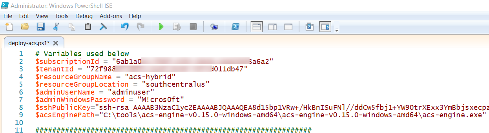
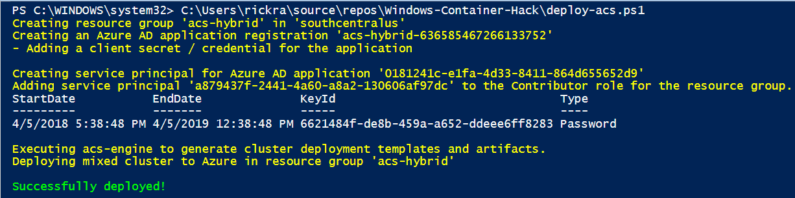

# Windows-Container-Hack

## Description
This repository contains scripts and artifacts to deploy a mixed cluster (Windws and Linux) using the [Azure acs-engine](https://github.com/Azure/acs-engine).  The cluster will consist of two agent pools where each pool contains two virtual machines.  One pool will consist of Windows virtual machines, and the other will consist of Linux/Ubuntu virtual machines.  The master node will be configured with Kubernete v1.10.

The resources used are as follows:
*  `deploy-acs.ps1` : PowerShell script that will deploy the cluster as described in the `kubernetes.json` file. 
* `kubernetes.json` : JSON file describing the cluster to be deployed by acs-engine.
* `acs-engine.exe` : The acs-engine reads the `kubernetes.json` file and generates the Azure Resource Manager (ARM) template, template parameter file, and other artifacts to deploy the cluster.  The files generated will be placed in an `_output` folder where `acs-engine.exe` exists on your machine.  The script will start a new Azure resource group deployment using the files generated under the `_output` folder.

** This has been tested with [Windows acs-engine v0.15.0](https://github.com/Azure/acs-engine/releases/tag/v0.15.0).**

## Requirements
* Azure subscription.
* PowerShell 3.0 or higher.
* Azure PowerShell Cmdlets, which can be downloaded and installed from [here](https://azure.microsoft.com/en-us/downloads/).
* Windows version of the Azure acs-engine, which can be downloaded from [here](https://github.com/Azure/acs-engine/releases/tag/v0.15.0).
* Code editor of your choice, such as [Visual Studio Code](https://code.visualstudio.com/Download).

## Instructions

1. Open `deploy-acs.ps1`.  Replace the variables at the top of the script with values from your environment.
   * `$subscriptionId` : Your Azure subscription Id.
   * `$tenantId` : The tenant / directory Id for your Azure subscription.
   * `$resourceGroupName` : The name of the resource group to deploy the cluster into.  This can be a new or existing resource group.
   * `$resourceGroupLocation` : The location you want to deploy the cluster in.  For example, _eastus_, _westus_, etc.
   * `$adminUserName` : The user name you want to use for the administrator profile on the Windows and Linux nodes.  This is also the administrator profile that will be used for the master node.
   * `$adminPassword` : The password that will be used to sign into the Windows agent pool nodes only.  The Linux agent pool nodes and master node will use the SSH key to sign-in.
   * `$sshPublicKey` : The SSH public key.  Make sure to leave the "ssh-rsa " string at the beginning.
   * `$acsEnginePath` : Full path to the `acs-engine.exe` file.

   An example showing the variables populated is shown here:
   
2. Run the script.
   * Note: The script will prompt you to authenticate to your Azure subscription.  You will also see a console window launch periodically when the script invokes acs-engine.exe to generate the ARM template and artifacts.

   The output for the script will look similar to the output shown here:
   